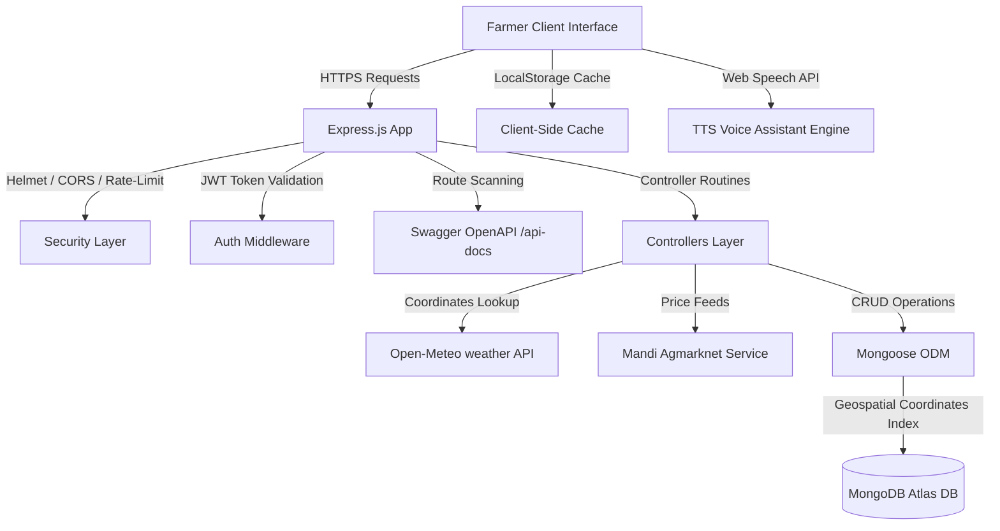

# KrishiMitra — Smart Farm Decision Support System

KrishiMitra is a MERN-stack decision support platform designed to empower smallholder farmers with micro-climate telemetry analytics, data-driven irrigation planners, crop suitability recommendation engine, local mandi price comparison tracking, and an interactive voice assistant.

---

## 📌 Problem Statement & Context
Agricultural yields globally face immense pressures due to unpredictable weather pattern changes and lack of localized scientific parameters. Smallholder farmers frequently over-irrigate (depleting groundwater and nutrients) or suffer crop failure from undetected pest/soil rust occurrences. Additionally, asymmetry in mandi commodity market pricing limits negotiating power.

**KrishiMitra solves this by:**
1. **Aggregating Climate Telemetry:** Connects to coordinates-based weather data to build local telemetry grids.
2. **Scheduling Precise Irrigation:** Recommends exact irrigation volumes based on crop water requirements and soil moisture levels.
3. **Automating NPK Crop Suitability:** Suggests the best crop matches by correlating soil structures and seasonal weather.
4. **Providing Mandi Price Feeds:** Synces mandi prices to identify peak selling opportunities.

---

## 🛠️ Technology Stack
- **Frontend:** React.js, Tailwind CSS, Recharts, Lucide Icons, Vite
- **Backend:** Node.js, Express, Helmet Security, CORS, Express-Rate-Limit
- **Database:** MongoDB, Mongoose (indexing & coordinate search)
- **APIs & Telemetry:** Open-Meteo API, Agmarknet Mandi Services
- **Browser Integrations:** HTML5 Web Speech Synthesis (TTS voice alerts), LocalStorage Caching, PWA service workers

---

## 📐 System Architecture Diagram



---

## 📂 Project Directory Structure

```text
KrishiMitra/
├── client/                      # Frontend Vite React App
│   ├── public/                  # Favicons, logo suites, site manifests
│   └── src/
│       ├── components/          # Reusable UI elements, App layout, Navbar
│       ├── context/             # Authentication & Farm profile contexts
│       ├── pages/               # Dashboard, Weather, Irrigation, Market pages
│       ├── routes/              # AppRouter with lazy-loaded dynamic routes
│       └── services/            # Client-side API request services
│
└── server/                      # Backend Node Express Server
    ├── config/                  # env checker, database connection, swagger
    ├── controllers/             # Auth, Farm, Weather, Market, Voice controllers
    ├── middleware/              # Auth parser, global exception catcher, validator
    ├── models/                  # User, Farm, Weather, Market price schemas
    ├── routes/                  # Express route mounting nodes
    ├── services/                # OpenMeteo service, price data service helpers
    └── utils/                   # Standardized ApiResponse helper utility
```

---

## 📋 API Catalog & Swagger Documentation
Our APIs are cataloged using Swagger OpenAPI standards. Once the server boots, visit:
👉 **`http://localhost:5000/api-docs`**

### Core Endpoints Summary:
- **Authentication:**
  - `POST /api/auth/register` — Create a farmer profile.
  - `POST /api/auth/login` — Get session JWT token.
- **Farm Profile:**
  - `POST /api/farms` — Register farm coordinates, land sizing, and crop types.
- **Climate Telemetry:**
  - `GET /api/weather/current` — Get Open-Meteo local telemetry logs.
- **Irrigation Planners:**
  - `GET /api/irrigation/recommend` — Receive irrigation volume decision recommendations.
- **Market Intelligence:**
  - `GET /api/market/current` — Current crop mandi rates.
  - `GET /api/market/history` — Mandi historical prices with pagination support.

---

## 🚀 Installation & Local Startup

### 1. Database Setup
Ensure you have a MongoDB instance running or configure a MongoDB Atlas connection string inside a `.env` file in the `server` directory:
```env
PORT=5000
MONGO_URI=mongodb+srv://<username>:<password>@cluster.mongodb.net/krishimitra
JWT_SECRET=your_jwt_secret_token
JWT_REFRESH_SECRET=your_jwt_refresh_token
NODE_ENV=development
```

### 2. Startup Server
```bash
cd server
npm install
npm run dev
```
*Console output confirms successful startup:*
> `Server Running in development mode on Port 5000`  
> `MongoDB Connected: <cluster-host>`

### 3. Startup Client
```bash
cd client
npm install
npm run dev
```
Open **`http://localhost:5173`** to access the dashboard. Enable the **"Judge Demo Mode"** in the top header action bar to view pre-loaded model farm telemetry immediately.
